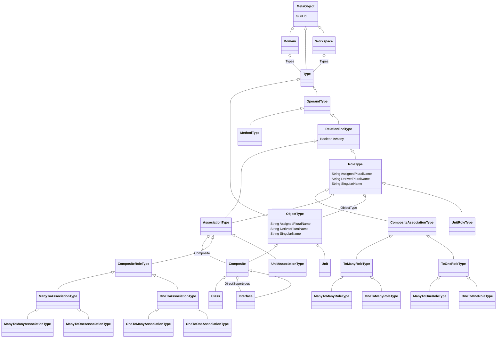

## Allors CORE

## Meta

```mermaid
classDiagram
    class AssociationType
    RelationEndType <|-- AssociationType
    AssociationType o-- Composite : Composite
    class Class
    Composite <|-- Class
    class Composite
    ObjectType <|-- Composite
    Composite o-- Interface : DirectSupertypes
    class CompositeAssociationType
    RoleType <|-- CompositeAssociationType
    class CompositeRoleType
    AssociationType <|-- CompositeRoleType
    class Domain
    MetaObject <|-- Domain
    Domain o-- Type : Types
    class Interface
    Composite <|-- Interface
    class ManyToAssociationType
    CompositeRoleType <|-- ManyToAssociationType
    class ManyToManyAssociationType
    ManyToAssociationType <|-- ManyToManyAssociationType
    class ManyToManyRoleType
    ToManyRoleType  <|-- ManyToManyRoleType
    class ManyToOneAssociationType
    ManyToAssociationType <|-- ManyToOneAssociationType
    class ManyToOneRoleType
    ToOneRoleType <|-- ManyToOneRoleType
    class MetaObject
    MetaObject : Guid Id
    class MethodType
    OperandType <|-- MethodType
    class ObjectType
    Type <|-- ObjectType
    ObjectType : String AssignedPluralName
    ObjectType : String DerivedPluralName
    ObjectType : String SingularName
    class OneToAssociationType
    CompositeRoleType <|-- OneToAssociationType
    class OneToManyAssociationType
    OneToAssociationType <|-- OneToManyAssociationType
    class OneToManyRoleType
    ToManyRoleType  <|-- OneToManyRoleType
    class OneToOneAssociationType
    OneToAssociationType <|-- OneToOneAssociationType
    class OneToOneRoleType
    ToOneRoleType <|-- OneToOneRoleType
    class OperandType
    Type <|-- OperandType
    class RelationEndType
    OperandType <|-- RelationEndType
    RelationEndType : Boolean IsMany
    class RoleType
    RelationEndType <|-- RoleType
    RoleType : String AssignedPluralName
    RoleType o-- AssociationType : AssociationType
    RoleType : String DerivedPluralName
    RoleType o-- ObjectType : ObjectType
    RoleType : String SingularName
    class ToManyRoleType 
    CompositeAssociationType <|-- ToManyRoleType 
    class ToOneRoleType
    CompositeAssociationType <|-- ToOneRoleType
    class Type
    MetaObject <|-- Type
    class Unit
    ObjectType <|-- Unit
    class UnitAssociationType
    AssociationType <|-- UnitAssociationType
    class UnitRoleType
    RoleType <|-- UnitRoleType
    class Workspace
    MetaObject <|-- Workspace
    Workspace o-- Type : Types
```
